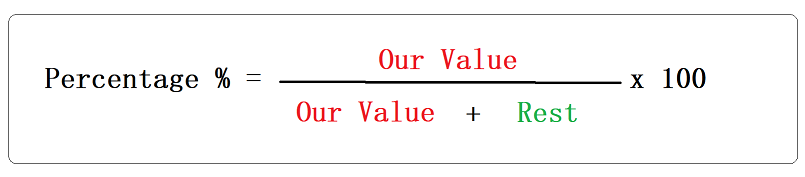

# Add_suffix_FileNaming_and_Reverse_Percentage_Calculation
This program helps you to add a suffix for all files in a directory with an option of adding an automatic incresing number as a suffix . And you can also calculate the number you should give to a value x in order to give you the exact percentage out of the total of the numbers

